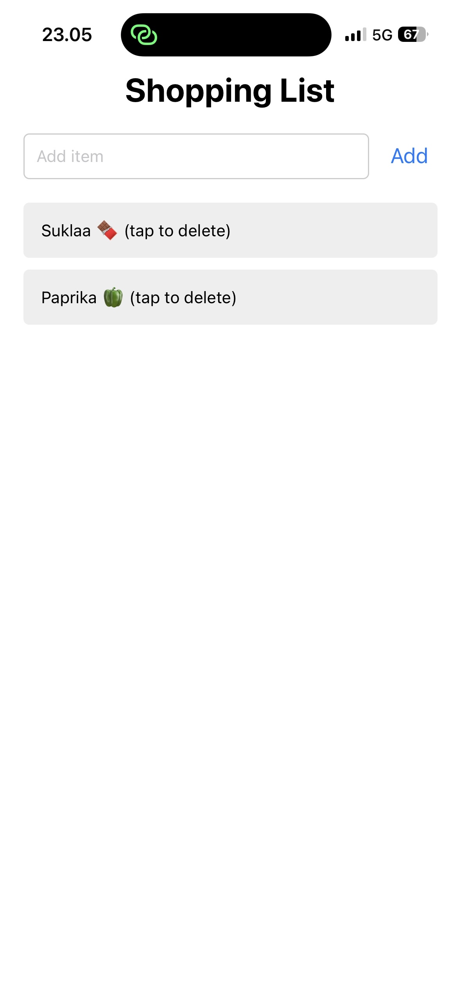
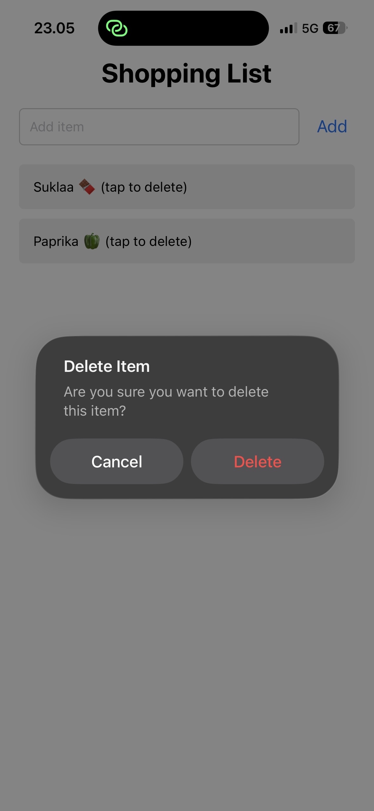

###Shopping App using Firebase

This project is a simple mobile shopping application built with React Native and Expo for the course Web- ja hybriditeknologiat mobiiliohjelmoinnissa. The application uses Firebase Firestore as a cloud database to store shopping list items. 

##Features:
- Add items to the shopping list
- View list of items
- Delete items from the list
- Real-time updates from the database
- Confirmation alert before deleting an item

This application retrieves (onSnapshot()), adds (addDoc()) and deletes (deleteDoc()) data. 

##Screenshots
1. Shopping list HomeScreen: main view of the application.

3. Delete confirmation alert: it appears when tapping an item asking to confirm if the user wants to delete it.

